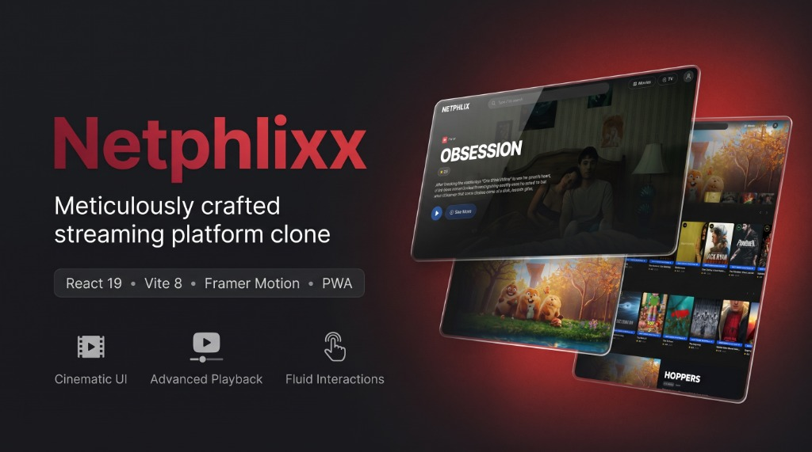

<div align="center">

  

  # 🎬 Netphlixx

  **A Highly Realistic, Premium Cinematic Streaming Platform Clone**

  [](https://netphlixx.vercel.app/)
  [](https://netphlixx.netlify.app/)
  [](https://github.com/shivamrajuniverse616-crypto/Netphlixx/raw/main/app-release.apk)
  [](https://github.com/shivamrajuniverse616-crypto/Netphlixx/blob/main/LICENSE)
  [](https://github.com/shivamrajuniverse616-crypto/Netphlixx/stargazers)

  [About](#-about-netphlixx) • [Features](#-features) • [Android App](#-native-android-application) • [Tech Stack](#-tech-stack) • [Installation](#️-installation--setup) • [Contributing](#-contributing)

</div>

---

## 📖 About Netphlixx

**Netphlixx** is a meticulously crafted streaming platform clone designed to mirror the premium user experience of industry-leading video-on-demand services. Engineered with cutting-edge web technologies, it features fluid animations, a highly responsive dark mode aesthetic, and robust media playback functionality. 

Whether you are browsing movies, checking out TV shows, or diving into trailers, Netphlixx delivers an immersive, app-like experience straight in your browser.

---

## 🚀 Features

### 🎨 Modern & Premium UI/UX
- **Cinematic Dark Theme:** A sleek, eye-catching interface with vibrant crimson accents and modern glassmorphism UI elements, inspired by industry leaders.
- **Fully Responsive:** Pixel-perfect design optimized for mobile devices, tablets, and massive desktop monitors.
- **Dynamic Theming:** Adapts color profiles instantly based on the content being viewed using `fast-average-color`, bringing the environment to life.

### ⚡ Fluid Animations & Interactions
- **Framer Motion Integration:** High-performance layout animations, micro-interactions, and page transitions that give the application a smooth, native-like feel.
- **Smart Search:** Instantly find what you are looking for with optimized filtering and debounced queries.

### 🎥 Advanced Media Playback
- **Seamless Streaming:** Comprehensive adaptive video playback utilizing **HLS.js**, **React Player**, and **React YouTube**.
- **Interactive UI:** Auto-playing hero banners, detailed movie information modals, and buttery-smooth horizontal content carousels.

### 📱 Progressive Web App (PWA) Support
- **Installable:** Save the app directly to your device home screen via `vite-plugin-pwa` for blazing-fast load times and offline caching capabilities.
- **Rich Iconography:** Beautiful, crisp vectors powered by `lucide-react` and `react-icons`.

---

## 🤖 Native Android Application

We have officially launched a dedicated native Android Application for Netphlixx to bring you an even better and smoother mobile experience! You can explore the entire Android source code in the [`android-app/`](android-app) folder.

### Key Benefits & How It Works
The Android application acts as a highly optimized wrapper for our progressive web app, utilizing a customized `WebView` to deliver a native-like experience:

- **Direct Download:** Get the latest stable release directly: [**`app-release.apk`**](app-release.apk)
- **Immersive Full-Screen Video:** Includes custom Chrome clients to support seamless fullscreen video playback, removing all browser UI for a true, uninterrupted cinematic experience.
- **Edge-to-Edge UI:** Renders the application completely edge-to-edge, coloring the status and navigation bars to match the app's dark cinematic theme perfectly.
- **Offline & Refresh Handling:** Features built-in "No Internet" fallback screens and a native pull-to-refresh layout for a polished feel.

### 🛡️ Built-in Ad & Popup Blocker
One of the biggest advantages of the Android App is its aggressive, built-in custom ad-blocker designed specifically for a seamless streaming experience. It bypasses intrusive ads and popups using a multi-layered approach:

1. **Network-Level Interception (`shouldInterceptRequest`):** The app actively intercepts every single network request made by the video players and blocks connections to a massive, hardcoded list of known ad networks, trackers, popup services, and crypto-miners.
2. **Popup & Redirect Blocking (`shouldOverrideUrlLoading`):** Streaming sites are notorious for invisible popunder redirects. The app prevents unauthorized navigations and blocks malicious domains from hijacking your screen.
3. **Dynamic CSS Injection:** For ads that manage to slip past the network filter, the app automatically injects custom CSS rules (`display: none !important`) immediately after the page loads to hide ad containers, banners, and sponsored overlays without breaking the video player.

---

## 💻 Tech Stack

| Category | Technology | Description |
| :--- | :--- | :--- |
| **Frontend Framework** | React 19, Vite 8 | Ultra-fast rendering and build tooling. |
| **Styling & UI** | Tailwind CSS 4, PostCSS | Utility-first CSS for rapid and beautiful UI. |
| **Animations** | Framer Motion | Production-ready animation library. |
| **Routing** | React Router DOM v7 | Dynamic client-side routing. |
| **Media Players** | HLS.js, React Player, React YouTube | Robust multimedia playback engines. |
| **Deployment** | Vercel (Main) & Netlify (Backup) | Edge-optimized global deployment. |

---

## 🛠️ Installation & Setup

Follow these simple steps to get a local copy of the project up and running for development and testing.

### Prerequisites
Make sure you have [Node.js](https://nodejs.org/) (v18+) and npm installed on your machine.

### Local Development

1. **Clone the repository:**
   ```bash
   git clone https://github.com/shivamrajuniverse616-crypto/Netphlixx.git
   ```

2. **Navigate to the directory:**
   ```bash
   cd Netphlixx
   ```

3. **Install dependencies:**
   ```bash
   npm install
   ```

4. **Start the development server:**
   ```bash
   npm run dev
   ```
   > The application will typically start on `http://localhost:5173`.

5. **Build for production:**
   ```bash
   npm run build
   ```

### 📱 Android App Installation

If you prefer using the native Android application instead of running it locally or through the browser:
1. Download the **[`app-release.apk`](app-release.apk)** directly to your Android device.
2. Tap the downloaded file to begin the installation process. *(Note: You might be prompted to allow "Installation from unknown sources" in your device's security settings).*
3. Open the **Netphlixx** app and enjoy the immersive experience!

---

## 🔒 Privacy & Security

Netphlixx is a frontend client application. It does not natively store sensitive user payment information or personal data on external unencrypted databases without explicit backend configurations.
- **Local Storage:** Used strictly for non-sensitive UI preferences (like themes and saved lists).
- **API Calls:** All external movie data requests should be routed over secure HTTPS connections.

---

## 🤝 Contributing

Contributions make the open-source community such an amazing place to learn, inspire, and create. Any contributions you make are **greatly appreciated**.

1. Fork the Project
2. Create your Feature Branch (`git checkout -b feature/AmazingFeature`)
3. Commit your Changes (`git commit -m 'Add some AmazingFeature'`)
4. Push to the Branch (`git push origin feature/AmazingFeature`)
5. Open a Pull Request

---

## 📜 License

Distributed under the MIT License. See [`LICENSE`](LICENSE) for more information.

> **Disclaimer:** This project is created strictly for educational and portfolio purposes only. It is not affiliated with, endorsed by, or in any way officially connected with Netflix, Inc. All trademarks are the property of their respective owners.

<br />

<div align="center">
  <b>Made with ❤️ by <a href="https://github.com/shivamrajuniverse616-crypto">Shivam Raj</a></b>
</div>
