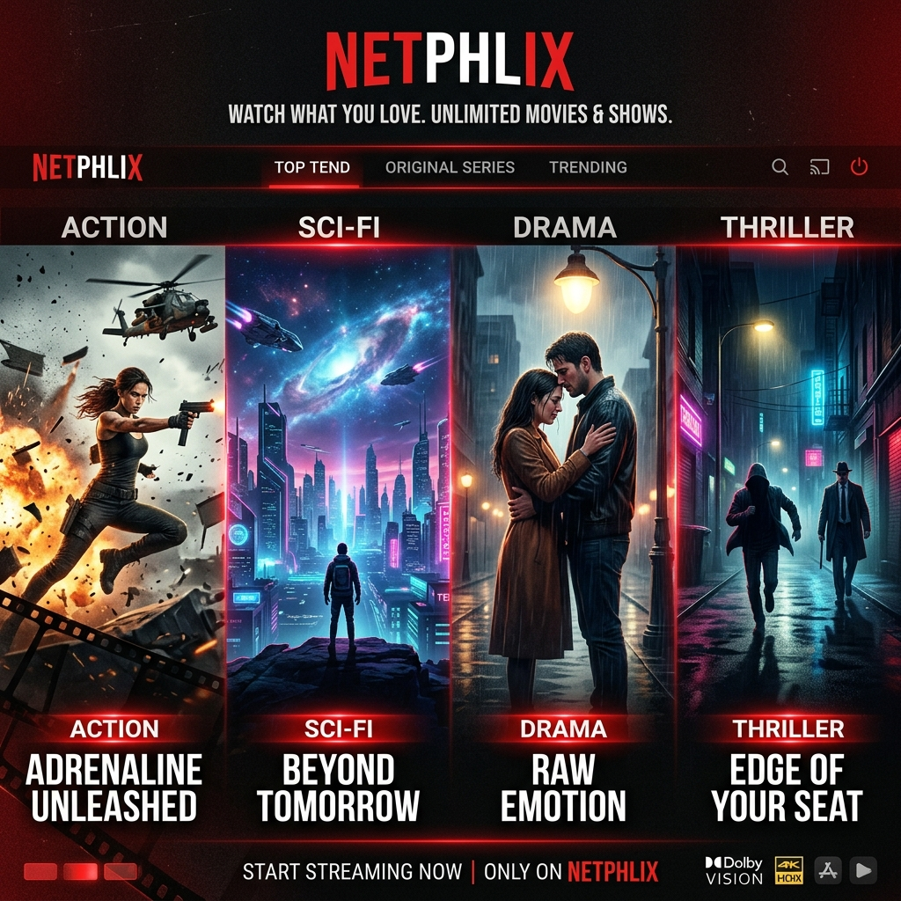
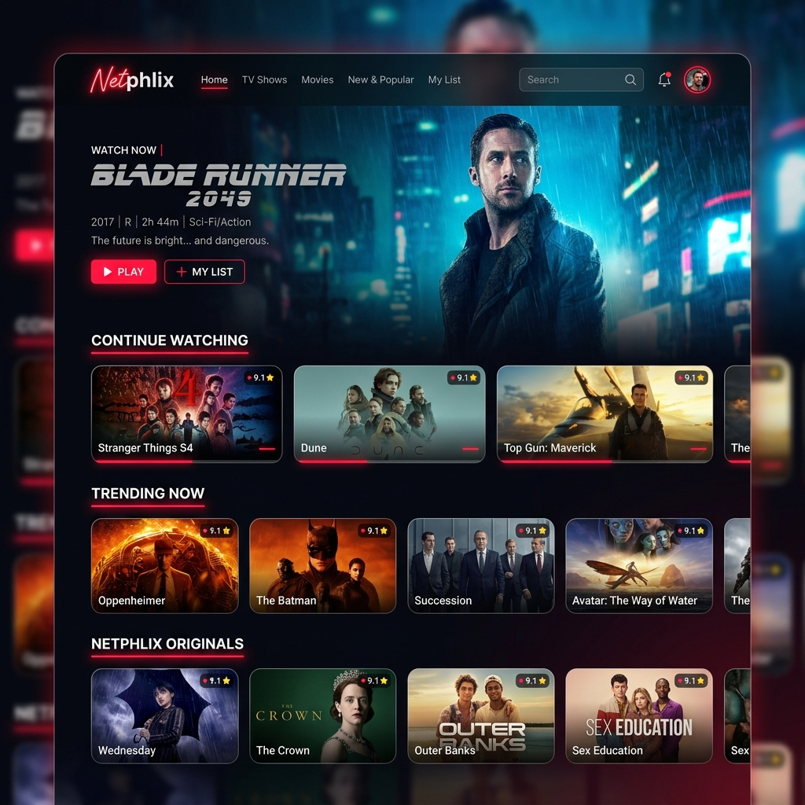

# 🎬 Netphlixx



Welcome to **Netphlixx**, a modern, cinematic, and fully-featured streaming platform clone built with cutting-edge web technologies. This project is designed to deliver a premium user experience with smooth animations, dark mode aesthetics, and robust media playback capabilities.

---

## 🌟 Features

- **Modern & Premium UI/UX:** A stunning dark-themed interface with vibrant red accents and glassmorphism elements.
- **Fluid Animations:** Powered by **Framer Motion** for a dynamic, application-like feel.
- **Advanced Media Playback:** Seamless video streaming with **HLS.js**, **React Player**, and **React YouTube**.
- **Progressive Web App (PWA):** Installable on your device for a native-like experience, thanks to `vite-plugin-pwa`.
- **Responsive Design:** Completely optimized for mobile, tablet, and desktop screens using **Tailwind CSS**.
- **Dynamic Theming:** Adapts to content with `fast-average-color`.
- **Rich Icons:** Utilizing both `lucide-react` and `react-icons` for sharp, beautiful iconography.

## 📸 UI Showcase



## 🛠️ Tech Stack

- **Frontend Framework:** React 19 + Vite 8
- **Styling:** Tailwind CSS 4
- **Animations:** Framer Motion
- **Routing:** React Router DOM v7
- **Video Players:** HLS.js, React Player, React YouTube
- **Linting & Code Quality:** ESLint, PostCSS

## 🚀 Getting Started

### Prerequisites
Make sure you have Node.js installed on your machine.

### Installation

1. **Clone the repository:**
   ```bash
   git clone https://github.com/shivamrajuniverse616-crypto/Netphlixx.git
   cd Netphlixx
   ```

2. **Install dependencies:**
   ```bash
   npm install
   ```

3. **Start the development server:**
   ```bash
   npm run dev
   ```

4. **Build for production:**
   ```bash
   npm run build
   ```

## 📜 License

This project is licensed under the MIT License.
